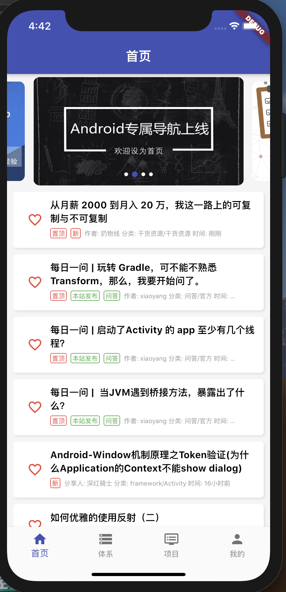
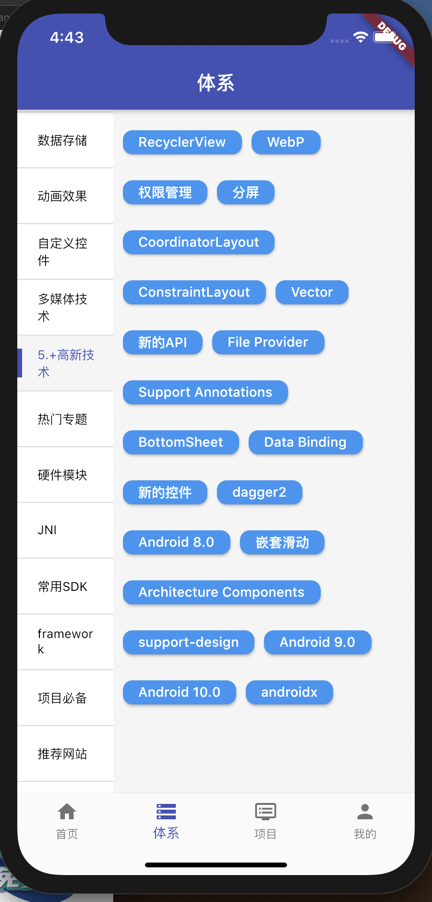
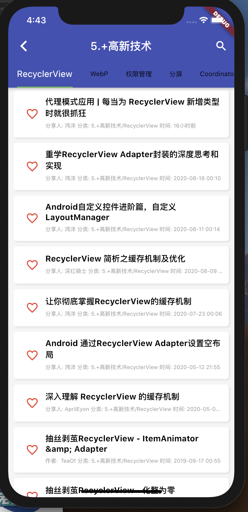
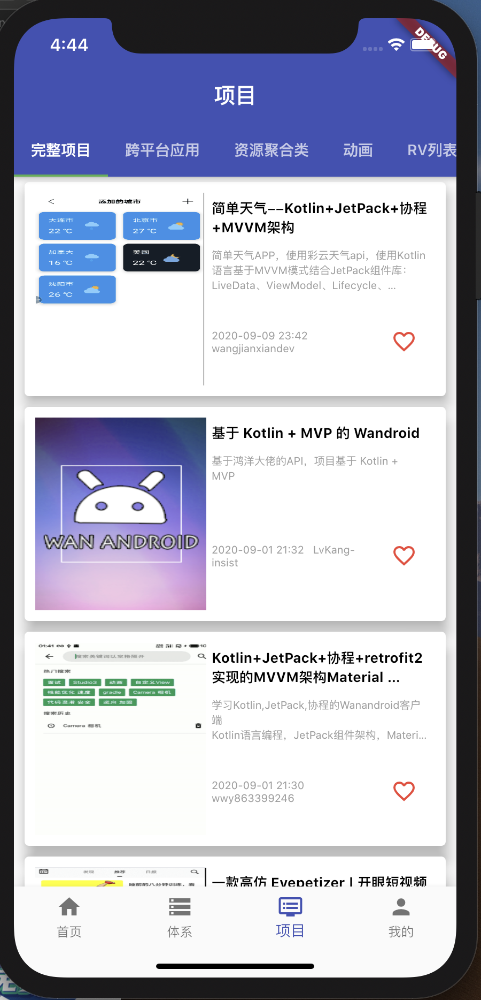
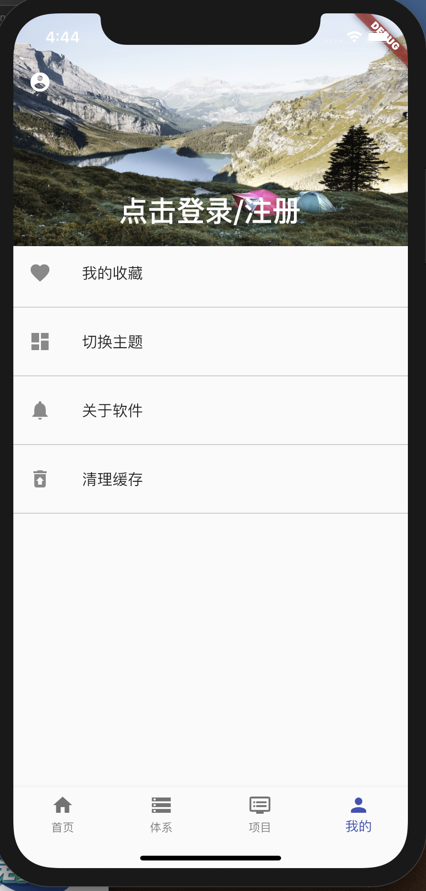
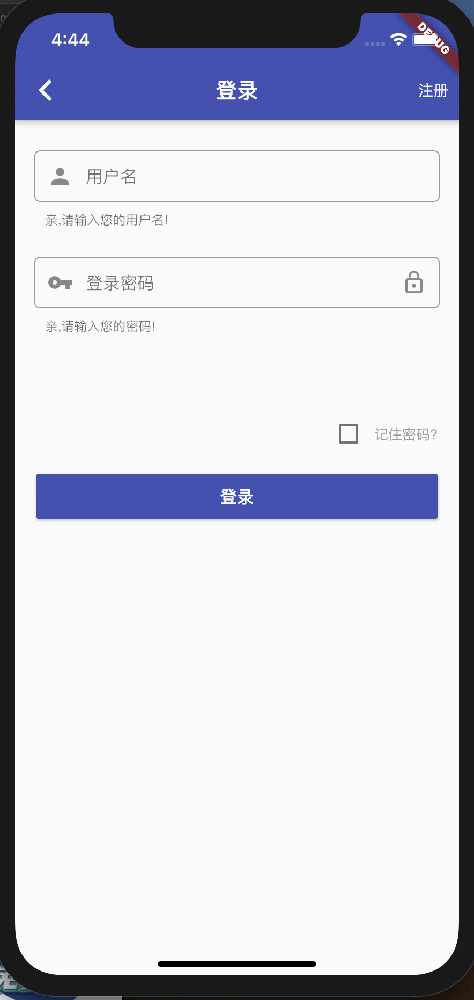

# flutterapp

A new Flutter application.

## Getting Started

This project is a starting point for a Flutter application.

A few resources to get you started if this is your first Flutter project:

- [Lab: Write your first Flutter app](https://flutter.dev/docs/get-started/codelab)
- [Cookbook: Useful Flutter samples](https://flutter.dev/docs/cookbook)

For help getting started with Flutter, view our
[online documentation](https://flutter.dev/docs), which offers tutorials,
samples, guidance on mobile development, and a full API reference.
##  关于该app
内容来源 : 参考鸿洋大神的玩安卓页面开发,使用的是该站点提供的开发API
开发目的: 学习flutter跨平台开发框架

### Flutter学习

[1.在flutter中构建布局](https://flutterchina.club/tutorials/layout/#approach)

#### 关于该项中用到的一些第三方库

1. flutter_swiper
2. flutter_webview_plugin
3. dio
4. dio_cookie_manager
5. dio_http_cache
6. pull_to_refresh
7. toast
8. path_provider
9. shared_preferences

#### app部分页面展示效果如下

#### app下载体验
[点击下载](https://www.pgyer.com/IrUX)

## 结尾
借鉴了不好开发者作品和思想,在此表以感谢!🙏🙏